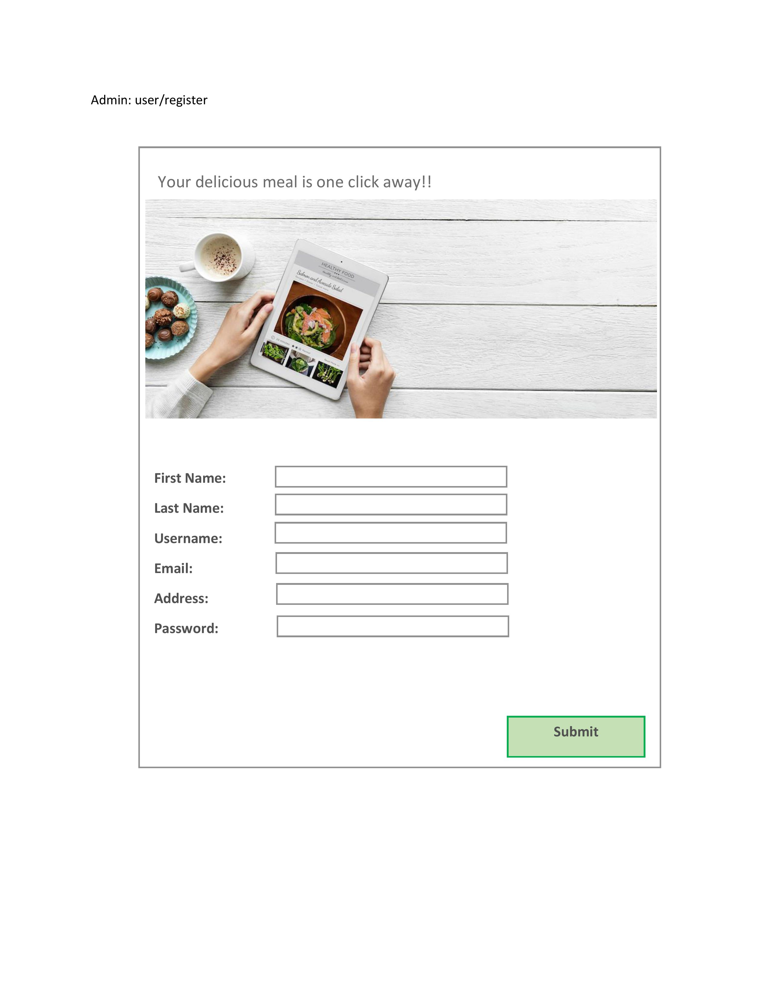
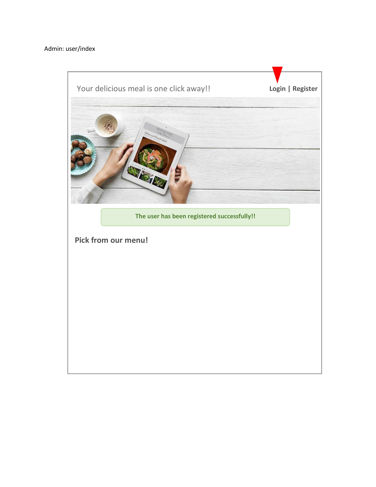
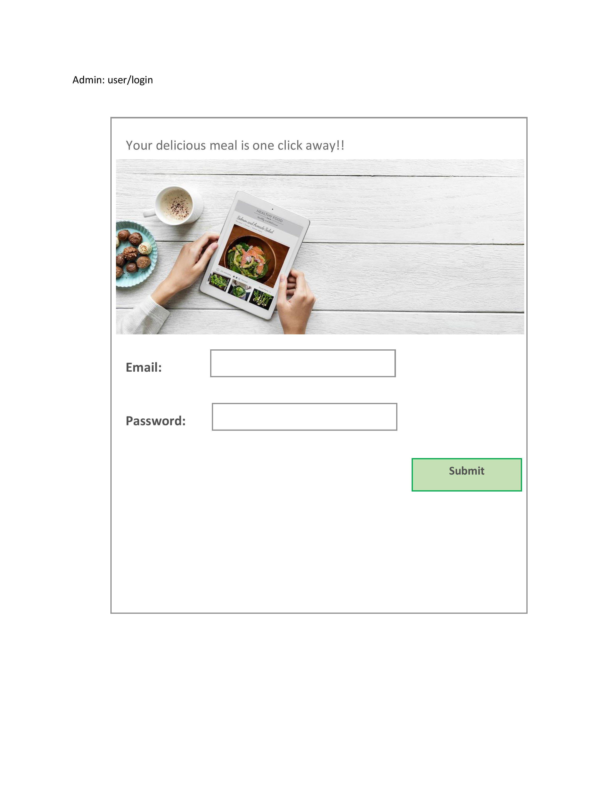
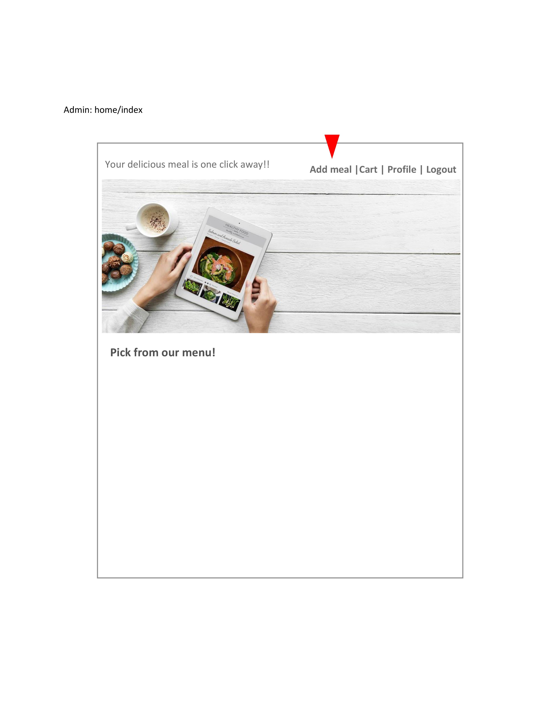
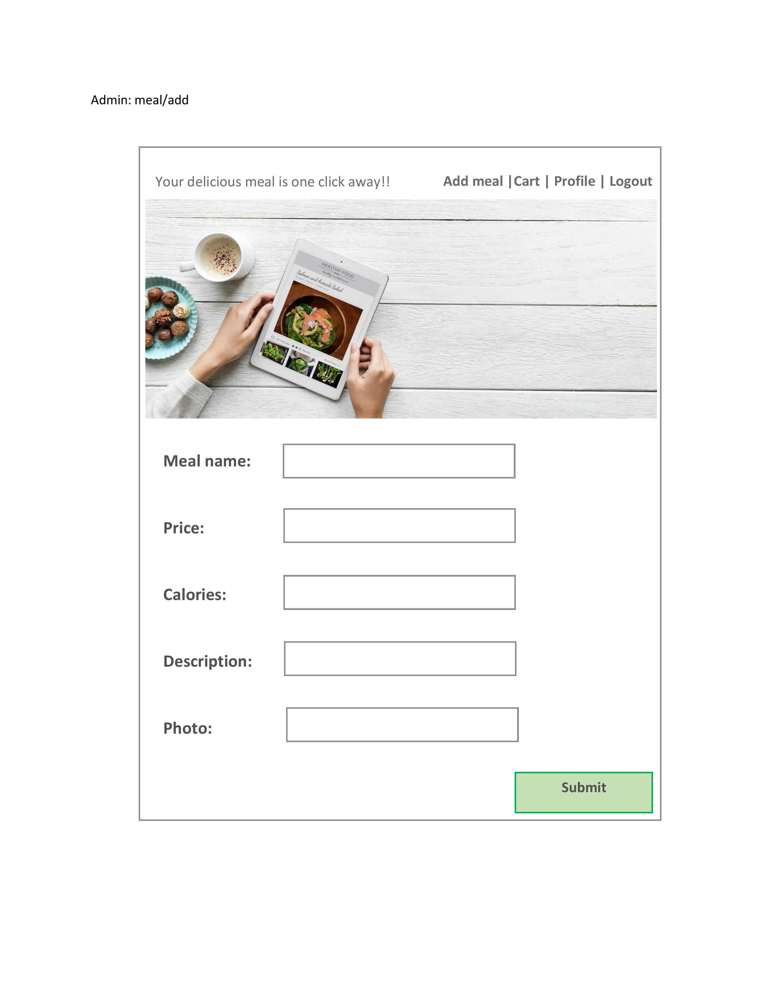
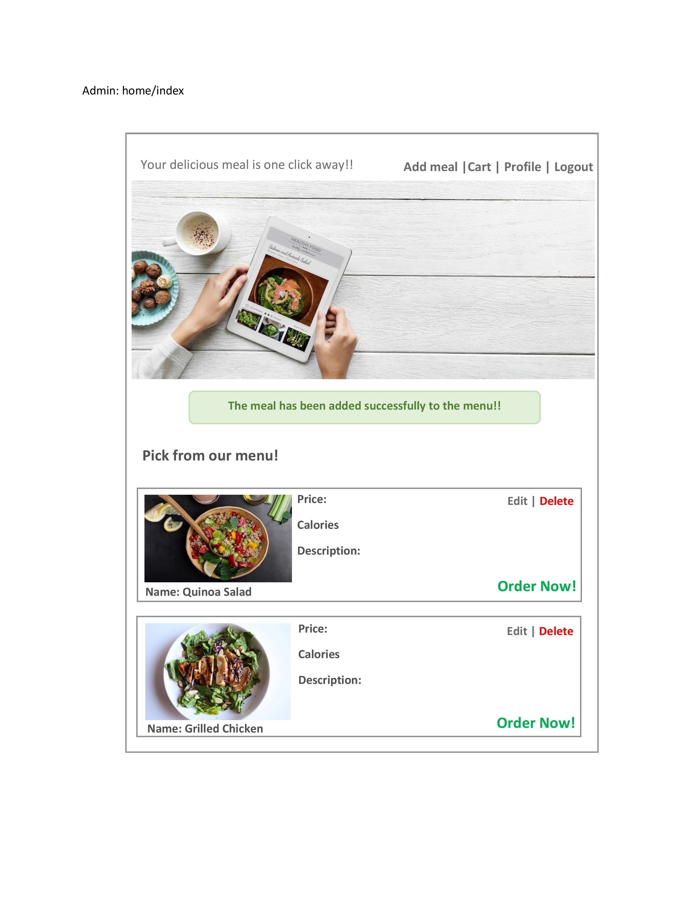
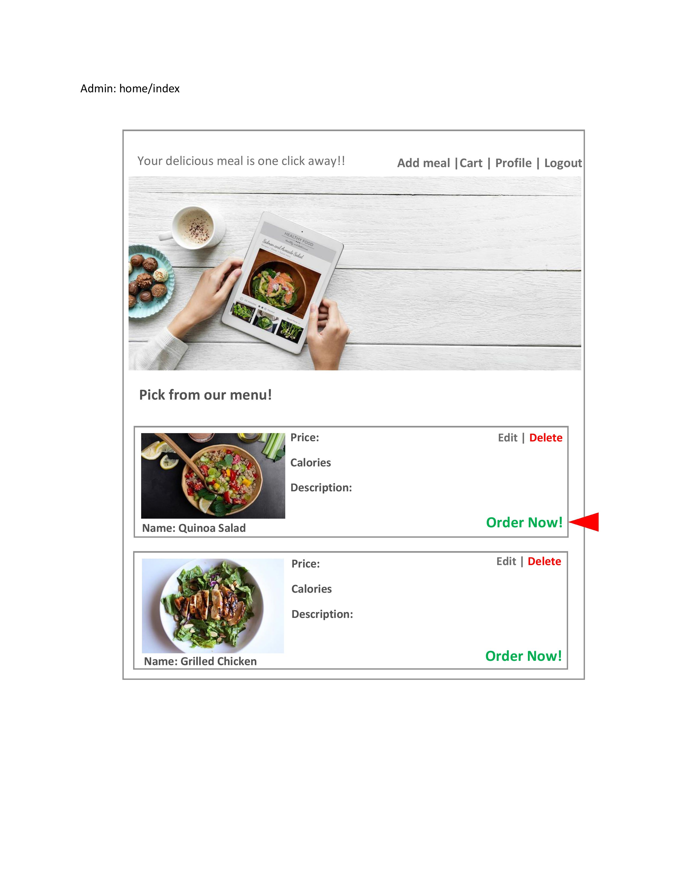
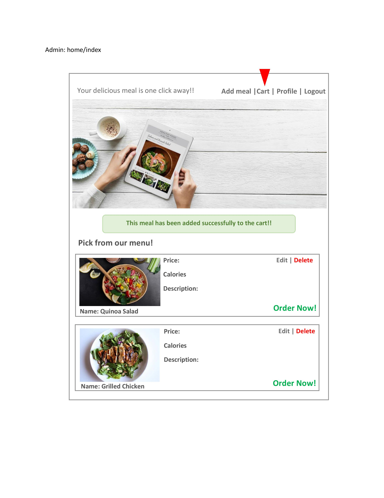
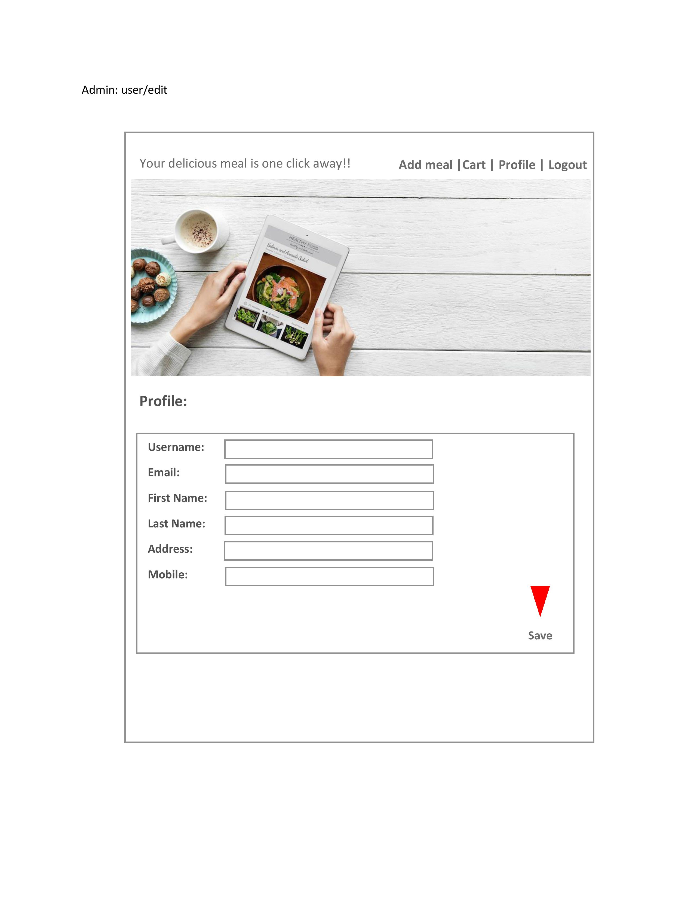
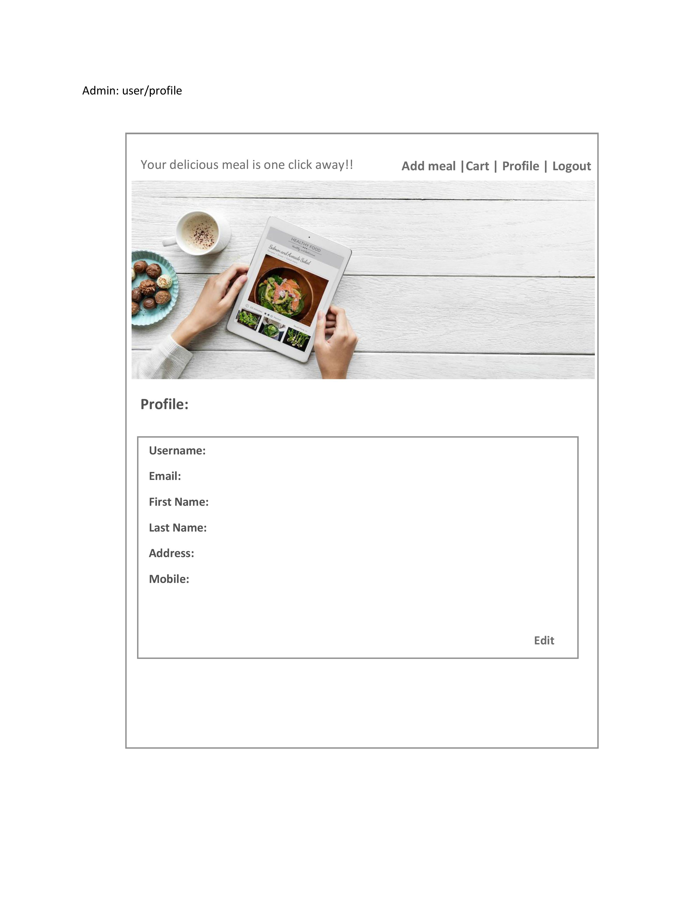

# Restaurant:

# Overview:
Restaurant, we have 2 user's Admin and user. The admin can add meals details in restaurant system each meal contain name, price , calories, pic and Meal description. The user can add meals to care and checkout.

# Technical Used:
<ul>
<li>Spring</li>
<li>CSS</li>
<li>HTML</li>
<li>Java Script</li>
<li>Boot Strap</li>
<li>Java</li>
<li>Github</li>
<li>Git Bash</li>
<li>Maven</li>
</ul>

# Wireframe:

# User Story:
<ul>
<li>As an Admin, I want to sign up, so the i can sign in.</li>
<li>As an Admin, I want to go to profile page, so the i can edit my profile.</li>
<li>As an Admin, I want to sign in, so the i can add meal details.</li>
<li>As an Admin, I want to sign in, so the i can delete meals.</li>
<li>As an Admin, I want to sign in, so the i can edit meals.</li>
<li>As an Admin, I want to add meal, so the i can make order.</li>
<li>As a user, I want to sign up, so the i can sign in.</li>
<li>As a user, I want to go to profile page, so the i can edit my profile.</li>
<li>As a user, I want to sign in, so the i can make order.</li>
<li>As a user, I want to choose meal, so the i can add to cart.</li>

</ul>
# Unsloved Problem:

# Challenges: 
<ul>
<li>Github, in the conflicts.</li>
<li>Deign pages by css in eclipse </li>
</ul>

